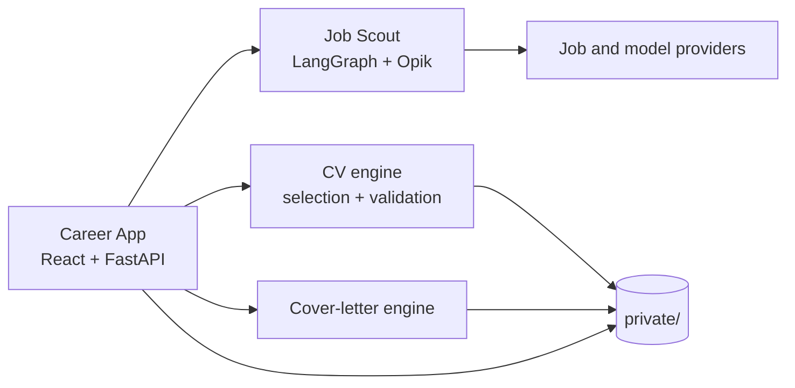

# Career Workspace

A privacy-first AI workbench for discovering roles, matching them to a candidate's evidence, and preparing truthful application materials.

The product combines a local React/FastAPI workspace with an observable job search agent, deterministic CV-family selection, evidence-grounded CV tailoring, and cover-letter generation. Candidate records, documents, credentials, and runtime databases stay outside Git under an ignored `private/` boundary.

## Why this exists

Job-search tools often optimize for generating more text. Career Workspace instead treats an application as a traceable workflow:

1. discover and rank relevant positions;
2. explain why a role matches the candidate's evidence;
3. select or tailor a CV without inventing claims;
4. draft a cover letter from structured, approved facts;
5. keep the candidate in control of review and submission.

AI assists with search, ranking, and drafting. It never submits an application, and generated claims must pass deterministic checks and human review.

## Architecture



| Component | Responsibility |
|---|---|
| `apps/career-app/` | Local UI, API, application registry, workflow orchestration |
| `integrations/job-scout/` | Multi-source discovery, ranking, tailoring, tracing, and evaluation |
| `packages/cv-engine/` | Explainable CV-family selection and guarded LaTeX tailoring |
| `packages/cover-letter-engine/` | Evidence-grounded letter generation and PDF rendering |
| `notebooks/` | Reproducible walkthroughs of the agent and evaluation strategy |
| `examples/` | Fictional, safe-to-publish demo inputs |
| `private/` | Ignored candidate data, documents, secrets, and runtime state |

Job Scout is adapted from [jamwithai/observable-job-agent](https://github.com/jamwithai/observable-job-agent). See [NOTICE](NOTICE) and its retained [MIT license](integrations/job-scout/LICENSE).

## Quick start

Prerequisites: Python 3.12, [uv](https://docs.astral.sh/uv/), and Node.js 22.

```bash
cp workspace.example.json workspace.json
cp .env.example .env
make setup
make check
make run
```

Open <http://127.0.0.1:8765>. Add provider keys to `.env` only for live search or model-backed generation; local tests and the synthetic dry-run need no credentials.

Run `make demo` to inspect a safe cover-letter prompt without making a model call. The demo uses a fictional candidate and employer from `examples/`.

## Quality and evaluation

The repository separates deterministic checks from model judgments:

- schema validation and source attribution constrain generated artifacts;
- CV tailoring rejects new includes, shell commands, and unsupported claims;
- Job Scout records node- and provider-level traces;
- hand-labeled datasets calibrate ranking and LLM-as-judge evaluations;
- unit and integration tests run without personal data;
- `make check-public` rejects tracked private paths, credentials, and common local-path leaks.

Run the local quality gate with `make check`. Networked and compiler-dependent tests are marked separately and excluded from the default CI job.

## Private-data contract

`workspace.example.json` documents the expected local layout. The real `workspace.json`, `.env` files, generated documents, databases, and everything under `private/`—except its explanatory README—are ignored.

Never put a real CV, profile, job tracker, application, email address, API key, or generated submission in `examples/`. Run `make check-public` before pushing.

## Project status

This is a working portfolio project, not an automated hiring or submission service. The local application and engines are functional; live provider paths require user-supplied credentials. See the component READMEs and notebooks for implementation details and evaluation findings.

Licensed under the [MIT License](LICENSE). Third-party attribution is recorded in [NOTICE](NOTICE).
