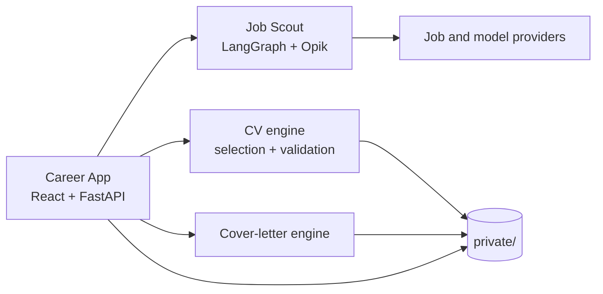

# Career Workspace

A local-first AI workbench for discovering roles, matching them to a candidate's evidence, and preparing application drafts for human review.

The product combines a local React/FastAPI workspace with an observable job search agent, deterministic CV-family selection, evidence-grounded CV tailoring, and cover-letter generation. Candidate records, documents, credentials, and runtime databases stay outside Git under an ignored `private/` boundary.

## Why this exists

Job-search tools often optimize for generating more text. Career Workspace instead treats an application as a traceable workflow:

1. discover and rank relevant positions;
2. explain why a role matches the candidate's evidence;
3. select or tailor a CV without inventing claims;
4. draft a cover letter from structured, approved facts;
5. keep the candidate in control of review and submission.

AI assists with search, ranking, and drafting. It never submits an application. Deterministic checks catch selected problems; they do not certify factual accuracy, so human review remains essential.

## Architecture



| Component | Responsibility |
|---|---|
| `apps/career-app/` | Local UI, API, application registry, workflow orchestration |
| `integrations/job-scout/` | Multi-source discovery, ranking, tailoring, tracing, and evaluation |
| `packages/cv-engine/` | Explainable CV-family selection and guarded LaTeX tailoring |
| `packages/cover-letter-engine/` | Evidence-grounded letter generation and PDF rendering |
| `notebooks/` | Reproducible walkthroughs of the agent and evaluation strategy |
| `examples/` | Fictional job description and prompt-only demo inputs |
| `private_example/` | Fictional CV family, prebuilt PDF previews, and profile for the local app demo |
| `private/` | Ignored candidate data, documents, secrets, and runtime state |

Job Scout is adapted from [jamwithai/observable-job-agent](https://github.com/jamwithai/observable-job-agent). See [NOTICE](NOTICE) and its retained [MIT license](integrations/job-scout/LICENSE).

## Quick start: fictional local demo

Prerequisites: Git, Make, Python 3.12, [uv](https://docs.astral.sh/uv/), and Node.js 22.12 or newer within Node 22. These instructions use Linux/Bash.

```bash
make setup
make build
env -u CAREER_DATA_DIR make run-demo
```

Open <http://127.0.0.1:8765>. John Doe's six example CV PDFs are ready to preview and copy. Keyword CV matching and application tracking work without credentials or LaTeX. Search attempts live sources; no offline job cache is shipped. Model-backed features need provider configuration and send relevant content to external providers.

`make run-demo` selects `workspace.demo.json` without changing `workspace.json`. The command above clears an inherited database override so records use the default ignored `.demo_runtime/` directory. Demo mode does not disable inherited credentials or network access. The equivalent flag is `env -u CAREER_DATA_DIR CAREER_DEMO=1 make run`.

Run `make demo` to inspect a safe cover-letter prompt without making a model call. See [private_example/README.md](private_example/README.md) for the app demo and LaTeX rebuild instructions.

For your own data, copy `workspace.example.json` to `workspace.json`, put your profile and CV sources under `private/`, and configure their paths. The current CV tailoring and rebuild path uses LaTeX; the prebuilt example PDFs make it optional for trying the app.

The main API has no user authentication and must remain local. Model-generated LaTeX compilation is not securely sandboxed; leave that feature unused on machines with sensitive files until isolation is implemented. See [Security](SECURITY.md).

## Documentation

- [Setup and first run](docs/setup.md): prerequisites, installation, John Doe demo, and verification.
- [Configuration](docs/configuration.md): personal data, CV families, LaTeX, secrets files, and environment precedence.
- [Usage](docs/usage.md): daily workflow, AI-ranking setup, tracker import, CLI tools, and development servers.
- [Troubleshooting](docs/troubleshooting.md): common errors, fresh-clone test fixtures, and known safety limitations.

## Project skill for Codex

The repository includes a [Career Workspace skill](.agents/skills/career-workspace/SKILL.md) for project-specific development, configuration, testing, documentation, and reviews. It routes agents to the existing guides and keeps public fixtures, personal inputs, and provider-backed actions separate.

For example:

```text
Use $career-workspace to review publication readiness without modifying personal data.
```

It lives in repository-scoped `.agents/skills/`, following [Codex's skill discovery conventions](https://learn.chatgpt.com/docs/build-skills#where-to-save-skills). It supports explicit and automatic selection; if it does not appear after creation, restart Codex. The skill is guidance, not a fix for the application's documented security limitations.

## Quality and evaluation

The repository separates deterministic checks from model judgments:

- schema validation and source attribution constrain generated artifacts;
- CV tailoring checks selected include/command patterns and known unsupported claims, but is not a security sandbox;
- standalone Job Scout can record node- and provider-level traces when configured;
- hand-labeled datasets calibrate ranking and LLM-as-judge evaluations;
- the default deterministic test suite uses fictional data;
- `make check-public` rejects tracked private paths and selected secret/local-path patterns; it is not a full secret or history scan.

Before running the local quality gate on a fresh checkout, generate the currently missing synthetic PDF test fixtures:

```bash
uv run --all-packages python integrations/job-scout/scripts/generate_fixture_cvs.py
make check
```

This is a documented workaround, not an automatic setup or CI step. Networked and compiler-dependent tests are marked separately and excluded from the default CI job.

## Private-data contract

`workspace.example.json` documents the expected private layout. The real `workspace.json`, `.env` files, generated documents, databases, and everything under `private/`—except its explanatory README—are ignored. `private_example/` is tracked and contains only invented data.

Never put a real CV, profile, job tracker, application, email address, API key, or generated submission in `examples/` or `private_example/`. Run `make check-public` before pushing.

## Project status

This is a working local portfolio project, not an automated hiring or submission service or a hardened public deployment. AI features and keyed job sources require user-supplied credentials; some job sources are keyless. See the component READMEs and notebooks for implementation details and evaluation findings.

Licensed under the [MIT License](LICENSE). Third-party attribution is recorded in [NOTICE](NOTICE).
