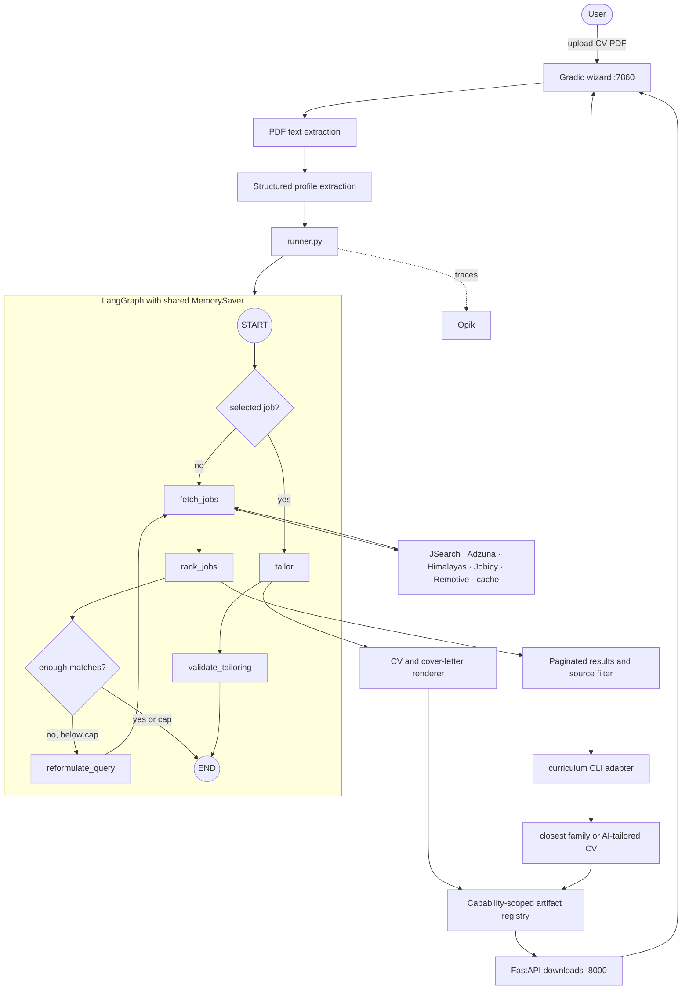

# Job Scout architecture

The current application has one Gradio surface and a minimal FastAPI download
service. Search and tailoring share one compiled LangGraph and its in-process
checkpoint.

## Search

The UI supplies a target role, the effective location preferences, residence
country, and a bounded result limit. Argentina searches have separate local and
remote lanes. The remote lane is filtered to postings compatible with a worker
residing in Argentina.

`run_search` fans out to configured live sources and falls back through keyless
sources and the committed cache. Every posting retains its source. Ranking
operates in parallel batches, retains existing scores across reformulation
loops, and caps the merged set. Pagination and source filtering happen over the
ranked in-memory result, so navigating does not rerun search or ranking.

## Tailoring and documents

Search and tailoring are two graph invocations on the same thread. A tailoring
invocation supplies the selected posting ID and reads the profile, CV text, and
ranked postings from the checkpoint. The deterministic validator checks the
tailored claims against the candidate corpus.

The application also sends the selected posting’s original description to the
curriculum repository’s `scripts/tailor_cv.py`. `cv_generation.py` validates
inputs, creates a unique slug and temporary UTF-8 job file, invokes the CLI with
an argument array and minimal environment, then parses the selected family and
generated artifacts. Offline mode explicitly uses `--select-only`; AI mode
requires a server-side OpenAI key.

Both renderers register exact generated files with `artifact_store.py`. The
browser receives only an opaque request ID and token. `api.py` resolves only the
files registered for that request, preventing arbitrary paths and cross-request
downloads.

## Observability

`runner.py` is shared by UI and batch entry points. It streams node status,
measures latency and token cost, and installs the optional Opik tracer. Job
sources get individual spans, while prompts are registered through the prompt
library. Configuration is centralized in `config.py`; secret values use
`SecretStr` and are not returned to browser code.
